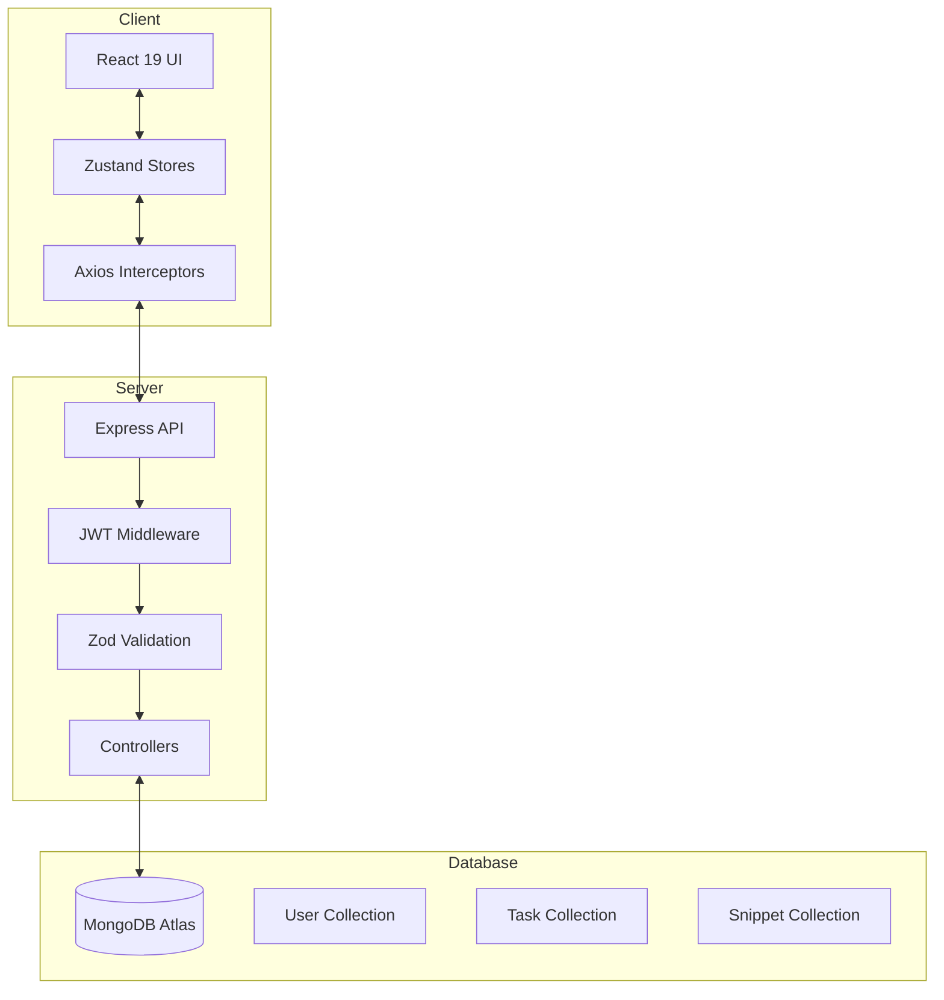

# 🚀 DevTrackr | Full-Stack Developer OS

DevTrackr is a premium, full-stack productivity ecosystem built for developers who want to track their growth, manage code snippets, and visualize productivity patterns in a futuristic dark-mode interface. 

Designed for **MAANG-level interviews**, this project demonstrates deep expertise in MERN stack architecture, advanced MongoDB aggregation, JWT security patterns, and premium UX design.

---

## 🛠️ Tech Stack

### Frontend
- **React 19** (Vite) - Modern UI with Concurrent Mode.
- **Zustand** - High-performance atomic state management.
- **Tailwind CSS** - Custom design system with glassmorphism.
- **Framer Motion** - Fluid, high-end animations.
- **Recharts** - Data visualization for productivity trends.
- **@dnd-kit** - Accessible drag-and-drop Kanban interface.

### Backend
- **Node.js & Express** - Scalable RESTful API architecture.
- **MongoDB Atlas** - Cloud database with compound indexing & text search.
- **JWT (JSON Web Tokens)** - Secure Access/Refresh token rotation.
- **Zod** - Type-safe request validation middleware.
- **Express Rate Limit** - Brute-force protection & API security.

---

## ✨ Key Features

### 📊 Advanced Analytics
- **Productivity Heatmap**: GitHub-style contribution tracking using custom aggregation logic.
- **Language Breakdown**: Real-time analysis of code snippet distributions via MongoDB `aggregate`.
- **Sprint Metrics**: Weekly productivity bar charts tracking task completion velocity.

### 📋 Intelligent Kanban
- **Drag-and-Drop**: Smooth, performance-tuned task management.
- **Optimistic Updates**: Zero-latency UI updates with background server synchronization.
- **Bulk Operations**: Efficient reordering using MongoDB `bulkWrite`.

### 💾 Developer Code Vault
- **Snippet Manager**: Syntax-highlighted code storage with full-text search.
- **Tagging System**: Organize snippets by language and custom tags.
- **Instant Search**: Server-side text indexing for high-speed retrieval.

### 🔐 Enterprise Security
- **Token Rotation**: Industry-standard Access/Refresh token pattern for secure sessions.
- **Rate Limiting**: Protection against API abuse and brute-force login attempts.
- **Sanitized Data**: Proper handle of Cross-Site Scripting (XSS) and data injection.

---

## 🏗️ Architecture



---

## 🚀 Getting Started

### Prerequisites
- Node.js (v18+)
- MongoDB Atlas account (or local MongoDB)

### Installation

1. **Clone and Install Frontend**
   ```bash
   npm install
   ```

2. **Setup Backend**
   ```bash
   cd server
   npm install
   ```

3. **Environment Configuration**
   Create `server/.env`:
   ```env
   PORT=5001
   MONGODB_URI=your_mongodb_atlas_uri
   JWT_SECRET=your_long_random_string
   JWT_REFRESH_SECRET=another_long_random_string
   JWT_EXPIRES_IN=15m
   JWT_REFRESH_EXPIRES_IN=7d
   CLIENT_URL=http://localhost:5180
   ```

4. **Run Application**
   - **Frontend**: `npm run dev` (starts on port 5180)
   - **Backend**: `cd server && npm run dev` (starts on port 5001)

---

## 📊 Performance & Optimization
- **Database Indexing**: Implemented text indexes for snippets and compound user-task indexes for $O(1)$ query speed.
- **Lazy Loading**: Code splitting used to optimize initial bundle size.
- **Optimistic UI**: Instant state updates on the frontend to provide a "local-first" feel.

---

## 👤 Author
**Rohit Dubey**
- GitHub: [@Rohitdubey-tech](https://github.com/Rohitdubey-tech)
- Portfolio: [Your Portfolio Link]
